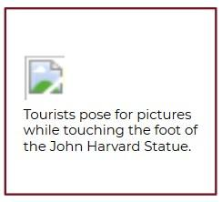
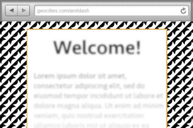
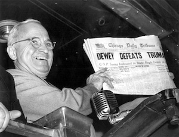
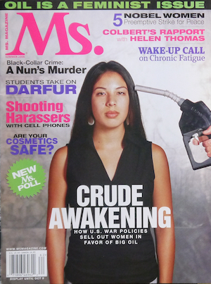
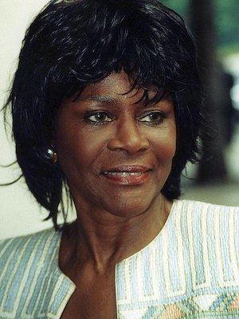
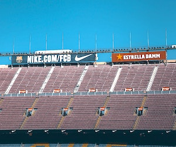
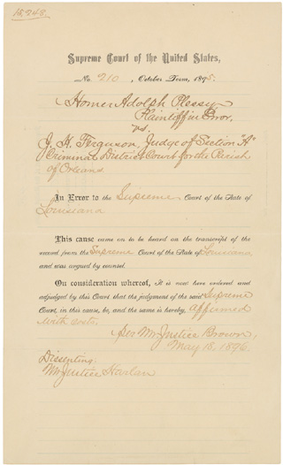
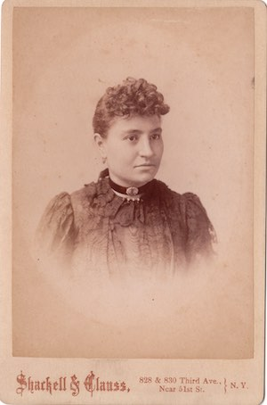

# Writing-Good-Alt-Text
A collection of guidelines found across the web for properly describing an image in words

## This doc is not definitive
This document does not claim to be comprehensive, and it's open to improvement. Under the license listed above, you are welcome to fork and modify it, print it or otherwise adapt it to your purposes. Pull requests are welcome.

## Rationale
Simply put, not every visitor to a web page or your social media post are using their eyes to see it! This includes more than people who are blind; there are many other forms of disabilities that reduce the clarity of a person's eyesight. Yet web pages should be usable to all people, regardless of their abilities.

### Alternative (Alt) Text is meant to convey the “why” of the image as it relates to the content of a document or webpage.
This is what is read aloud to non-sighted users by their screen reader software. It is both a social justice issue (of recognizing the diversity of all people), as well as a matter of legal compliance with the Americans With Disabilities Act (ADA).
- A web page that does not have Alt Text on every image fails the WCAG Accessibility Guidelines' [first standard (1.1.1)](https://www.boia.org/wcag2/cp/1.1.1).
- This includes a webpage that is showing a Timeline of social media posts.
- That means everyone who attaches an image on a social media post should be adding Alt Text to describe that image — *every time.*
   - On Mastodon, follow either bot [@PleaseCaption@botsin.space](https://botsin.space/@pleasecaption) or [@alt_text@mastodon.social](https://mastodon.social/@alt_text) to get a reminder when you forget.

### Alt Text also benefits sighted people!
Alt Text is indexed by search engines, so that (say, Google) can suggest the right image you’re searching for. Alt Text displays on the page if the image somehow fails to load, as in this example of a missing image:

# Guidelines for good Alt Text

## 1. Keep things short and descriptive – something about the length of a tweet.
The problem with being over-wordy is that it takes up a lot of time for the non-sighted person to listen through it. Already, perusing a webpage by sound takes MUCH longer than by sight. So non-sighted users can get frustrated when content creators make it especially slow for them to get their work done.

## 2. In general, don't start with the words “image of…” or “photo of…”
Just say what it is:  `A green velvet dress.`
- `A blue and black dress.`
*Ahem.* 
- `A white and gold dress.`
*[ARGH!](https://en.wikipedia.org/wiki/The_dress)*
- `The iconic viral photo of a woman's dress with washed-out colors, which has been argued incessantly as to whether it appears blue or gold.`

Avoid the abbreviation B&amp;W, instead write it out for the screen reader software to read: `water-stained black and white photo of my grandmother`

See, sometimes you may decide to break a guideline, if doing so will better assist the non-sighted user to glean the equivalent, relevant information from the image.

## 3. An image that is purely decorative does *not* need Alt Text.
For example, don’t write Alt Text for the cool pattern used in the background of a webpage. The WCAG standard for a decorative image is **null** Alt Text. In code, this is:  `alt=""`

But, if the same image were a thumbnail on a site for buying wallpaper, then it does need Alt Text:

| Example | Alt text |
| ----- | ----- |
|  | `A pattern of white inverted on black, in alternating interlocking shapes of concave and convex arcs` |

## 4. Use the general rule of: Object • Action • Context
Alt Text should try to communicate the same experience that you wanted a sighted person to get. So it depends on the context for why the image is there. Here are some examples:

| Example | Alt text |
| ----- | ----- |
|  | Not enough context:  `The President holds up a newspaper.`   **Better:** `Harry Truman smiling as he holds a copy of the Chicago Daily Tribune with a bold headline ‘Dewey Defeats Truman’` |
|  | Not enough context:  `The cover of Ms. Magazine`   **Better:** `A 2006 cover of Ms. Magazine centers a Latina woman with a gasoline pump nozzle pointed at her head, almost like a gun. The largest headline reads: CRUDE AWAKENING - How U.S. war policies sell out women in favor of Big Oil` |

Side notes, because lawyers:
- *The image above of Truman, [whose copyright status seems disputed](https://commons.wikimedia.org/wiki/File:Dewey_Defeats_Truman.jpg), is used here greatly scaled down under the principle of Fair Use for an educational purpose.*
- *The image above of Ms. Magazine is licensed under Creative Commons CC-BY-SA 4.0 as confirmed by [Wikimedia Commons](https://commons.wikimedia.org/wiki/File:Ms._magazine_Cover_-_Summer_2006.jpg).*

## 5. Use these general rules for a headshot:
1. **Say that it's a headshot.** This already implies that the person is dressed professionally and is (probably) smiling.
2. Include the person’s **full name** in the Alt Text.
3. If the person is **doing something**, describe it:  e.g. holding something, pointing into the crowd, or sitting in front of a particular background that communicates visual information.
4. **Don't over-describe** the person. Don't mention their clothing, hair, accessories, etc., unless it is truly communicating important info about the context here.

| Example | Alt text |
| ----- | ----- | 
|  | Not enough context:  `headshot of Ms. Tyson`   **Better:** `Headshot of Cicely Tyson`   …But over-described:  `Headshot of Cicely Tyson from the shoulders up smiling in an embroidered top with a low-cut neckline.` |
|  | Not enough context:  `Humerous headshot of Jane`   **Better:** `Headshot of Jane Doe smiling casually as she holds up a 10-inch knife`   …But over-described:  `Headshot of Jane Doe with cute cropped bangs, bright red lipstick, and a simple blouse while she mischeviously holds up a butcher knife, her head cocked to one side.` |

- *Note: the photo of Ms. Tyson is by John Mathew Smith & celebrity-photos.com from Laurel, MD, [CC BY-SA 2.0](https://creativecommons.org/licenses/by-sa/2.0), via Wikimedia Commons.*

## 6. The context matters!
So there’s no single ‘right’ way to compose the Alt Text. Consider this same image on two different websites:

| Example | On this kind of website | Alt text |
| ----- | ----- | ----- | 
|  | Essay about the COVID pandemic | `bleachers sit entirely empty inside a massive stadium` |
|  | Marketing opportunities | `crowning the upper section of stadium bleachers are two billboards emblazoned with corporate names and logos` |

## 7. For images that have words in them
Generally speaking, you need to transcribe *all* the words, because a non-sighted person deserves to obtain the same information from the image as a sighted person. But apply this guideline within reason. (For example, you would not transcribe the smaller, minor headlines on the newspaper that Harry Truman is holding. On the marketing website in #6, the specific brand names are not really important.)

When a photograph has handwriting on it, or if the image has words baked into its pixels, you should convey that in the Alt Text.

| Example #1 | 
| ----- | 
|  |
| `A weathered parchment document reads the following: Supreme Court of the United States, No. 210, October Term, 1895. Homer Adolph Plessy, Plaintiff in Error, vs. J.H. Ferguson, Judge of Section 'A' Criminal District Court for the Parish of Orleans. In Error to the Supreme Court of the State of Louisiana. This cause came on to be heard on the transcript of the record from the Supreme Court of the State of Louisiana, and was argued by counsel. On consideration whereof, It is now here ordered and adjudged by this Court that the judgement of the said Supreme Court, in this cause, be, and the same is hereby, affirmed with costs. Per M. Justice Brown, May 18, 1896. Dissenting: M. Justice Harlan.` |
| …But honestly, that takes a long time for a screen reader to announce. For a document that long, it would be much better to provide a link on the page to the Full Transcript. Then in Alt Text, notify the reader where they can get the transcript: |
| `A parchment document from the US Supreme Court in 1895 refers to Homer Plessy as a Plaintiff against Judge Ferguson of the Criminal District Court of Orleans Parish. A full transcript of this image is provided on this page` &nbsp;/&nbsp; `in the subtweets of this thread.` |

- *Note: this image is courtesy of the [US National Archives](https://www.archives.gov/historical-docs/todays-doc/index.html?dod-date=518).* Records of the Supreme Court of the United States; Record Group 267; Plessy v. Ferguson, 163, #15248; *Plessy vs. Ferguson,* Judgement, Decided May 18, 1896.

| Example #2 | 
| ----- | 
|  |
| `Headshot of an unknown woman appears on the yellowed paper of a carte de viste. No year is given but the bottom of the card reads: Shackell & Clauss, 828 & 830 Third Ave., Near 51st Street, N.Y.` |

