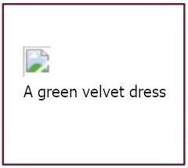

# Writing-Good-Alt-Text
A collection of guidelines found across the web for properly describing an image in words

## Rationale
Simply put, not every visitor to a web page or your social media post are using their eyes to see it! This includes more than people who are blind; there are many other forms of disabilities that reduce the clarity of a person's eyesight. Yet web pages should be usable to all people, regardless of their abilities.

**Alternative (Alt) Text** is meant to convey the “why” of the image as it relates to the content of a document or webpage. This is what is read aloud to non-sighted users by their screen reader software. It is both a social justice issue (of recognizing the diversity of all people), as well as a matter of legal compliance with the Americans With Disabilities Act (ADA).
- A web page that does not have Alt Text on every image fails the WCAG Accessibility Guidelines' [first standard (1.1.1)](https://www.boia.org/wcag2/cp/1.1.1).
- This includes a webpage that is showing a Timeline of social media posts.
- That means everyone who attaches an image on a social media post should be adding Alt Text to describe that image — *every time.*

**Alt Text also benefits sighted people!** Alt Text is indexed by search engines, so that (say, Google) can suggest the right image you’re searching for. Alt Text displays on the page if the image somehow fails to load, as in this example of a missing image:

## Guidelines for good Alt Text
### 1. Keep things short and descriptive – something about the length of a tweet.
The problem with being over-wordy is that it takes up a lot of time for the non-sighted person to listen through it. Already, perusing a webpage by sound takes MUCH longer than by sight. So non-sighted users can get frustrated when content creators make it especially slow for them to get their work done.

### 2. In general, don't start with the words “image of…” or “photo of…”
Just say what it is:  `A green velvet dress.`
- `A blue and black dress.`
*Ahem.* 
- `A white and gold dress.`
*[ARGH!](https://en.wikipedia.org/wiki/The_dress)*
- `The iconic viral photo of a woman's dress with washed-out colors, which has been argued incessantly as to whether it appears blue or gold.`

See, sometimes you may decide to break a guideline, if doing so will better assist the non-sighted user to glean the equivalent, relevant information from the image.

### 3. An image that is purely decorative does *not* need Alt Text.
For example, don’t write Alt Text for the cool pattern used in the background of a webpage. The WCAG standard for a decorative image is **null** Alt Text. In code, this is:  `alt=""`

But, if the same image were a thumbnail on a site for buying wallpaper, then it does need Alt Text:

| Example | Alt text |
| ----- | ----- |
|  | `A pattern of white inverted on black, in alternating interlocking shapes of concave and convex arcs` |

